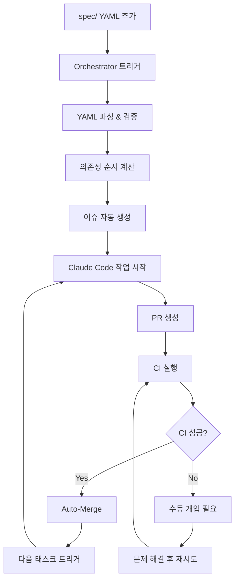

# 🚀 GitHub Actions 워크플로우 구성 완료

## 구축된 워크플로우들

### 1. 🎼 Orchestrator (`orchestrator.yml`)
- **트리거**: `spec/` 폴더 변경시
- **기능**: YAML 파싱 → 의존성 해결 → 순차적 이슈 생성
- **결과**: 각 모듈마다 3개 이슈 (Implementation → Testing → Integration)

### 2. 🔀 Auto-Merge (`auto-merge.yml`)
- **트리거**: PR 생성/업데이트시
- **기능**: CI 통과 확인 → 자동 머지 → 다음 태스크 트리거
- **조건**: `auto-generated` 라벨 + CI 성공

### 3. 🏷️ Label Setup (`setup-labels.yml`)
- **트리거**: 수동 실행 또는 워크플로우 변경시
- **기능**: 필요한 라벨들 자동 생성/업데이트
- **라벨 종류**: 자동화, 개발단계, 상태, 우선순위 등

## 🎯 자동화 플로우

## ✅ 설정 완료 사항

- [x] 기본 프로젝트 구조
- [x] Orchestrator 워크플로우
- [x] Auto-merge 워크플로우  
- [x] 라벨 관리 시스템
- [x] 이슈 템플릿

## 🔧 다음 필요 설정

1. **GitHub Secrets 설정** (Repository Settings → Secrets):
   - `CLAUDE_API_KEY`: Claude API 접근키
   - `PAT_TOKEN`: Personal Access Token

2. **브랜치 보호 규칙** (Repository Settings → Branches):
   - Require PR before merging
   - Require status checks

3. **Actions 권한** (Repository Settings → Actions):
   - Read and write permissions
   - Allow creating PRs

## 🧪 테스트 준비

이제 실제 모듈 스펙을 추가하여 전체 시스템을 테스트할 준비가 완료되었습니다!
