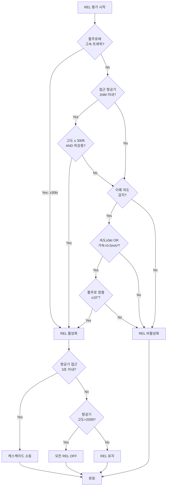
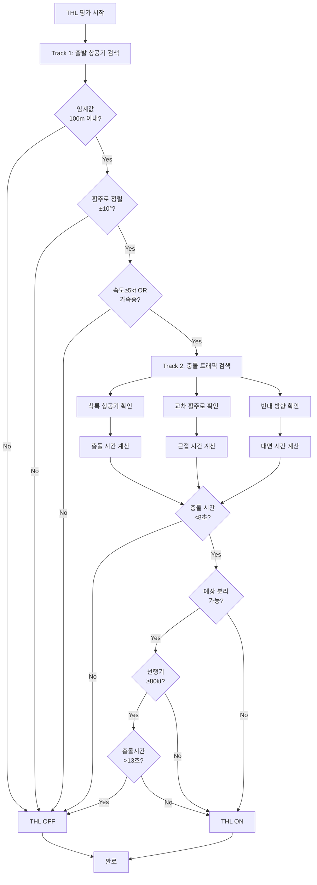
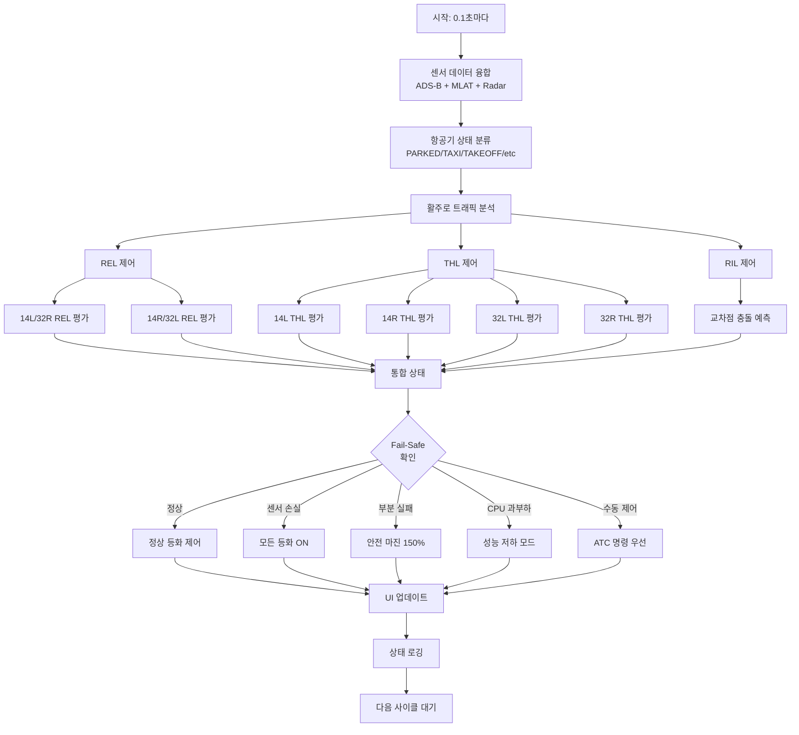

# RWSL 알고리즘 플로우차트

## 1. REL 활성화 플로우차트



## 2. THL 이중 추적 플로우차트



## 3. 통합 RWSL 시스템 플로우



## 4. REL 방향성 감지 알고리즘

```
┌─────────────────────────────────┐
│         REL 방향성 감지          │
└─────────────────────────────────┘
                │
                ▼
        ┌───────────────┐
        │ REL 벡터 계산 │
        │ (끝점-시작점) │
        └───────┬───────┘
                │
        ┌───────▼────────────┐
        │   REL 타입 확인    │
        │ D(TO) or A(FROM)?  │
        └───────┬────────────┘
                │
    ┌───────────┴───────────┐
    │                       │
    ▼                       ▼
┌─────────┐           ┌─────────┐
│D(TO RWY)│           │A(FROM)  │
│왼쪽 90° │           │오른쪽90°│
└────┬────┘           └────┬────┘
     │                     │
     └──────────┬──────────┘
                │
        ┌───────▼───────────┐
        │  항공기 벡터 계산  │
        │ (항공기-REL중심)  │
        └───────┬───────────┘
                │
        ┌───────▼───────────┐
        │   접근 각도 계산   │
        │ angle(벡터1,벡터2)│
        └───────┬───────────┘
                │
        ┌───────▼───────────┐
        │  각도 ≤ 45° ?     │
        └───────┬───────────┘
                │
         ┌──────┴──────┐
         │             │
         ▼             ▼
     ┌────────┐   ┌────────┐
     │감지 YES│   │감지 NO │
     └────────┘   └────────┘
```

## 5. 충돌 시간 계산 알고리즘

```
착륙 충돌 시간 = |착륙ETA - 이륙완료시간|

착륙ETA = 현재고도 / 하강률 × 60
이륙완료시간 = {
    if (속도 ≥ 30kt): 20초
    else: 30초
}

교차 충돌 시간 = {
    if (평행활주로_고속트래픽): 5초 (고정)
    else: ∞
}

반대 충돌 시간 = 활주로길이 / (속도1 + 속도2)
```

## 6. 김포공항 특화 매핑

```
14L/32R 활주로
├── 14L 방향 (143°)
│   ├── REL: A→B1→B2→C1→C2→C3→D1→D2→D3→E1→E2→F2→G1→G2
│   └── THL: 14L 임계값 (37.5706°N, 126.7784°E)
│
└── 32R 방향 (323°)
    ├── REL: G2→G1→F2→E2→E1→D3→D2→D1→C3→C2→C1→B2→B1→A
    └── THL: 32R 임계값 (37.5478°N, 126.8070°E)

14R/32L 활주로
├── 14R 방향 (143°)
│   ├── REL: W1→W2→B1→C1→D1→E1→G1
│   └── THL: 14R 임계값 (37.5683°N, 126.7755°E)
│
└── 32L 방향 (323°)
    ├── REL: G1→E1→D1→C1→B1→W2→W1
    └── THL: 32L 임계값 (37.5481°N, 126.8009°E)
```